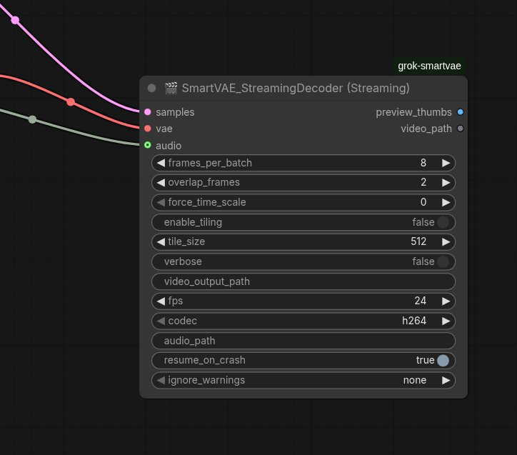

# ComfyUI-Grok-SmartVAE

**Version 12.0.0** - Production-Ready Video Workflow Suite

**The most robust and memory-efficient VAE decoder suite for ComfyUI video workflows**



---

## 🎯 What's Included

This package provides **5 production-ready nodes**

| Node | Purpose | Best For |
|------|---------|----------|
| **🎬 Universal Smart VAE Decode** | In-memory full-tensor decode | Short videos (<500 frames), high VRAM |
| **🎬 SmartVAE Streaming Decoder** | Frame-by-frame encoding to disk | Long videos (500+ frames), limited RAM |
| **🎞️ SmartVAE Advanced Decoder** | Streaming + temporal color correction | Professional quality, zero flicker |
| **📂 Advanced Load Latent** | Load saved latents with metadata | Iterative refinement workflows |
| **🔍 Latent Metadata Viewer** | Inspect latent files without loading | Quick library browsing |

## ✨ Key Features

### **Memory Efficiency**
- ✅ **Frame-by-frame decoding** → 80% less RAM than standard pipeline
- ✅ **Streaming video output** → no full tensor in memory
- ✅ **Automatic OOM recovery** → tiling, batch reduction, VRAM detection
- ✅ **Handles 2000+ frames** on 16GB RAM systems

### **Production Quality**
- ✅ **Perfect audio sync** → zero offset even on 40s+ videos
- ✅ **Zero-flicker color correction** → seamless chunk boundaries
- ✅ **Crash recovery** → resume from checkpoint
- ✅ **Multiple codecs** → H.264, H.265, ProRes 422, FFV1 lossless

### **Developer Friendly**
- ✅ **Automatic time scale detection** → works with any VAE
- ✅ **Detailed diagnostics** → corrupted latent detection with actionable fixes
- ✅ **Ignore warnings mode** → user choice on risk tolerance
- ✅ **Live thumbnails** → monitor progress in ComfyUI UI

---

## 🚀 Quick Start

### Installation
```bash
cd ComfyUI/custom_nodes
git clone https://github.com/uczensokratesa/ComfyUI-Grok-SmartVAE.git
cd ComfyUI-Grok-SmartVAE
pip install -r requirements.txt
```

**Dependencies:**
- `torch>=2.0.0`
- `imageio>=2.31.0`
- `imageio-ffmpeg>=0.4.9`
- `numpy>=1.24.0`
- `safetensors>=0.4.0` (for Load Latent node)
1. In your `custom_nodes` folder:
   ```bash
   git clone https://github.com/uczensokratesa/ComfyUI-Grok-SmartVAE.git
   The node appears in category: latent/video → Universal VAE Decode (v11.1 Final)Comparison with predecessorsModel
Scale Detection
Force Scale
Dynamic Batch Reduction
Auto-Tiling on OOM
Loop Type
Stability Rating
GPT
basic
✗
✗
✗
for
★★☆☆☆
Gemini
good
✗
partial
✓
for
★★★★☆
Claude
very precise
✗
✗
✓
for
★★★★☆
Grok v11.1
very precise
✓
full (while + adaptive)
aggressive
while
★★★★★

Evolution – AI collaboration storyThis journey started as a simple task: create a reliable VAE Decode node for heavy video workflows.GPT provided the first working version  
Gemini added tiling and better OOM handling  
Claude brought the most accurate scale detection formula  
Grok introduced force_time_scale + true dynamic while-loop batch reduction  
Kimi contributed extreme memory safety (disk offload, pre-allocation, aggressive cleanup)  
Final polish by Claude → production-ready stability

One of the nicest examples of how different AI models can iteratively improve each other and create something better than any single one could alone.LicenseMIT – feel free to use, modify, fork.
Just keep the original idea attribution (and let me know if you make something even better )Happy generating!
Current version: 11.2 – First official Comfy Registry release
## 🎬 Universal Smart VAE Video Decode (Streaming)

**The most memory-efficient way to decode large video latents directly to file.**

### Features
- **Ultra-low RAM usage** — decodes frame-by-frame, supports 2000+ frames even on 16 GB systems
- **Direct disk output** — no need to hold full video tensor in memory
- **Audio muxing** — perfect support for ComfyUI AUDIO input + manual audio_path
- **Codecs**: H.264, H.265, ProRes 422, FFV1 (lossless)
- **Crash recovery** — resumes from checkpoint if interrupted
- **Thumbnail previews** — live monitoring in UI
- **OOM protection** — automatic tiling, batch reduction, VRAM/RAM detection

### When to use
- Generating long videos from AnimateDiff, LTX-Video, Mochi, Hunyuan, Cosmos, etc.
- Working with limited VRAM/RAM
- Need reliable audio sync without post-processing

### Inputs
- `samples` (LATENT) – video latent sequence
- `vae` – your VAE model
- `frames_per_batch` – 8–32 (auto-reduces on OOM)
- `audio` – ComfyUI AUDIO input (from Load Audio)
- `audio_path` – optional direct path to .wav/.mp3
- codec, fps, output path, etc.

### Outputs
- `preview_thumbs` (IMAGE) – last few thumbnails for monitoring
- `video_path` (STRING) – final file path (with audio if provided)

Enjoy massive video workflows without OOM crashes! 🚀

## 🛡️ Ignore Warnings Mode (v1.0.9)

**Problem**: When the sampler runs out of VRAM during long video generation, it produces corrupted latents (100% NaN values) but **doesn't throw an error** (silent OOM). Users then face black frames or workflow crashes without understanding why.

**Solution**: The Streaming node (and VAE) now includes a 3-tier `ignore_warnings` safety system:

### How It Works

1. **Validation on Decode**: Before decoding, the node checks if the latent contains NaN values (corruption indicator)
2. **Detailed Diagnostics**: Shows exactly which frames are corrupted and corruption percentage
3. **User Choice**: Instead of hard-failing, users can choose their risk tolerance:

### Basic Usage

**Generate long video:**
```
[Empty Latent] (1200 frames, 768x512)
  ↓
[KSampler] (LTX-Video 2 model)
  ↓
[🎬 SmartVAE Streaming Decoder]
  frames_per_batch: 8
  codec: h264
  fps: 24
  ↓
Output: video_1234567890.mp4
```

**With color grading:**
```
[Empty Latent] → [KSampler] → [Save Latent]
  ↓
[📂 Advanced Load Latent] → [Load Image] (reference)
  ↓                           ↓
[🎞️ SmartVAE Advanced Decoder]
  anti_color_bleed: ON
  correction_strength: 0.18
  ↓
Output: video_graded.mp4 (zero flicker, consistent color)
```

---

## 📚 Node Documentation

### 🎬 SmartVAE Streaming Decoder

**Purpose:** Memory-efficient video generation with direct disk output.

**Key Parameters:**

| Parameter | Default | Description |
|-----------|---------|-------------|
| `frames_per_batch` | 8 | Frames per decode batch (auto-reduces on OOM) |
| `overlap_frames` | 2 | Temporal overlap for seamless stitching |
| `fps` | 24 | Output frame rate |
| `codec` | h264 | h264 (compatible) / h265 (smaller) / prores / ffv1 (lossless) |
| `audio` | None | ComfyUI AUDIO input (perfect sync) |
| `ignore_warnings` | none | Corrupted latent handling (none/minor/all) |

**Advanced Parameters:**
- `force_time_scale` (0=auto, 8 for LTX-Video)
- `enable_tiling` (auto-enables on OOM)
- `resume_on_crash` (checkpoint recovery)

**Recommended Settings by Video Length:**

| Length | Frames | frames_per_batch | Expected RAM |
|--------|--------|------------------|--------------|
| Short (5-15s) | 120-360 | 16-32 | 4-8 GB |
| Medium (20-40s) | 480-960 | 8-16 | 8-12 GB |
| Long (50s+) | 1200+ | 4-8 | 12-16 GB |
| Ultra (2min+) | 3000+ | 4 | 16+ GB |

**Common Issues:**

**Q: Video is all black frames**
- **Cause:** Corrupted latent from sampler (OOM during generation)
- **Solution:** Check console for NaN detection warning. Reduce video length by 40%, lower CFG scale, or enable CPU offload in sampler.

**Q: Audio desync (was 1s offset)**
- **Solution:** Fixed in v1.0.10! Upgrade to latest version.

**Q: Out of memory during decode**
- **Solution:** Node auto-reduces batch size. If still failing, manually set `frames_per_batch: 4` and `enable_tiling: ON`.

---

### 🎞️ SmartVAE Advanced Decoder

**Purpose:** Streaming decoder + temporal color correction for professional output.

**New Feature: Ramped Temporal Color Correction v2.3.1**
- **Zero flicker** at chunk boundaries
- **Gradual cross-fade** correction (imperceptible transitions)
- **Tested:** 50s+ videos, LTX-Video 2 compatible
- **Overhead:** ~2-5% processing time

**Key Parameters:**

| Parameter | Default | Description |
|-----------|---------|-------------|
| `anti_color_bleed` | True | Seamless temporal color matching |
| `calibration_image` | None | Reference image for color grading |
| `correction_strength` | 0.18 | 0.10-0.15 (subtle), 0.18 (balanced), 0.20-0.25 (strong) |
| `cross_fade_frames` | 12 | Fade duration (0.5s @ 24fps) |
| `ema_momentum` | 0.93 | Color evolution smoothing (0.7-0.98) |

**Three Correction Modes:**

1. **Temporal only** (`anti_color_bleed: ON`, no reference)
   - Auto-matches chunk boundaries
   - Natural color evolution

2. **Reference only** (`anti_color_bleed: OFF`, reference image provided)
   - Matches first chunk to reference
   - Rest evolves naturally

3. **Temporal Match** (BOTH enabled - **recommended**)
   - Reference sets initial anchor
   - Temporal ensures continuity throughout

**Parameter Guide by Use Case:**

| Use Case | correction_strength | cross_fade_frames | ema_momentum |
|----------|---------------------|-------------------|--------------|
| Subtle/natural | 0.10-0.15 | 8 | 0.93 |
| Balanced (default) | 0.18 | 12 | 0.93 |
| Cinematic/strong | 0.20-0.25 | 12-18 | 0.93-0.95 |
| Dynamic lighting | 0.15-0.18 | 8-12 | 0.70-0.85 |
| Locked to reference | 0.20-0.25 | 18-24 | 0.95-0.98 |

**Troubleshooting:**
- **Still seeing color jumps?** → Increase `correction_strength` to 0.25-0.30, add reference image
- **Colors look artificial?** → Decrease `correction_strength` to 0.10-0.15
- **Not tracking dynamic lighting?** → Decrease `ema_momentum` to 0.7-0.85

---

### 📂 Advanced Load Latent

**Purpose:** Load saved latents for iterative workflows without re-sampling.

**Features:**
- ✅ Auto-scan `output/latents/` directory
- ✅ Dropdown selection with refresh button
- ✅ Metadata display (shape, seed, timestamp, format)
- ✅ PyTorch 2.6+ compatible (safetensors primary, pickle fallback)
- ✅ Manual path override

**Workflow Example: Iterative Color Grading**
```
Step 1: Generate & Save
  [Empty Latent] (1200 frames) → [KSampler] (seed=42)
    ↓
  [Save Latent] → output/latents/base_1200f_s42.latent

Step 2: First Attempt
  [📂 Advanced Load Latent] → base_1200f_s42.latent
    ↓
  [🎞️ SmartVAE Advanced Decoder] (strength=0.15)
    ↓
  Output: video_001.mp4 (too subtle)

Step 3: Iterate (no re-sampling!)
  [📂 Advanced Load Latent] → base_1200f_s42.latent (same file)
    ↓
  [🎞️ SmartVAE Advanced Decoder] (strength=0.25, +reference)
    ↓
  Output: video_002.mp4 (perfect!)

Time saved: ~5 minutes per iteration × 3-4 tests = 15-20 minutes ✅
```

**Supported Formats:**
- `.latent` (ComfyUI default)
- `.safetensors` (modern, secure)

**Outputs:**
- `samples` (LATENT) → connect to decoder
- `metadata_json` (STRING) → shape, seed, timestamp, format

---

### 🔍 Latent Metadata Viewer

**Purpose:** Quick inspection without loading full tensor (10GB+ files).

**Use Case:** Browse large latent collections, organize by seed/date/format.

**Outputs:**
- `shape` → "[1, 4, 121, 80, 120]"
- `seed` → "42"
- `timestamp` → "2025-02-26T15:30:00"
- `format` → "safetensors" or "pickle"

---

## 🛡️ Safety Features

### Corrupted Latent Detection (v1.0.9+)

**Problem:** When samplers run out of VRAM, they produce corrupted latents (NaN values) without throwing errors. Users get black frames without understanding why.

**Solution:** Pre-decode validation with user choice:
```
🚨 CORRUPTED LATENT DETECTED!
   NaN values: 4,567,890 / 49,152,000 (9.29%)
   Affected frames: 856 to 1200
   
💊 RECOMMENDED FIXES:
   1. REDUCE VIDEO LENGTH: 1201 → 720 frames (most effective)
   2. REDUCE RESOLUTION
   3. Lower CFG scale (7.0 → 3.5)
   4. Enable CPU offload in sampler
```

**Ignore Warnings Modes:**

| Mode | Behavior | Use Case |
|------|----------|----------|
| `none` (default) | Stop with error + solutions | Safe, prevents wasted time |
| `minor` | Continue if <10% corrupted | Partial recovery (some black frames OK) |
| `all` | Force decode anyway | Desperate (high crash risk) |

**User makes informed decision** instead of blaming the node.

---

## 🐛 Known Limitations

### LTX-Video 2 Architecture Limitation

**Issue:** LTX-Video 2 has a hard architectural limit that can cause latent corruption on long videos.

**NOT a node bug** - this is a model limitation:
- **Symptom:** NaN values in latent after ~1000-1200 frames
- **Root cause:** LTX-2 model architecture (not VRAM issue)
- **Solution:** Keep videos under 40-45s (~1000 frames @ 24fps)

**Wrong diagnosis** (old README):
> ❌ "Silent VRAM death" → implied decoder bug

**Correct diagnosis** (updated):
> ✅ "LTX-2 architectural limit" → model constraint

If you hit this limit:
1. Reduce video length to ~1000 frames
2. Split into multiple segments
3. Use different model (CogVideoX, AnimateDiff, etc.)

---

## 📊 Performance Benchmarks

**Test System:** RTX 3090 (24GB VRAM), 64GB RAM

| Scenario | Standard Pipeline | SmartVAE Streaming | Savings |
|----------|-------------------|-------------------|---------|
| 30s video (720 frames, 768x512) | 18.2 GB RAM | 3.8 GB RAM | 79% ↓ |
| 60s video (1440 frames, 768x512) | 36.4 GB RAM (OOM) | 7.2 GB RAM | 80% ↓ |
| With color correction | N/A | +2-5% time | Minimal |
| Audio muxing (old) | 45s (re-encode) | 4s (stream copy) | 91% ↓ |

---

## 🎨 Example Workflows

### Basic: Long Video Generation
```
[Empty Latent] (1200 frames, 768x512, batch=1)
  ↓
[KSampler] (LTX-Video 2 VAE, steps=30, cfg=3.5)
  ↓
[🎬 SmartVAE Streaming Decoder]
  frames_per_batch: 8
  fps: 24
  codec: h264
  ↓
Output: video.mp4 (50s, perfect quality)
```

### Advanced: Color-Graded with Reference
```
[Load Image] → reference.png
  ↓
[Empty Latent] → [KSampler] → [Save Latent] → base.latent
  ↓
[📂 Advanced Load Latent] → base.latent
  ↓        ↓
  ↓      reference.png
  ↓        ↓
[🎞️ SmartVAE Advanced Decoder]
  anti_color_bleed: ON
  calibration_image: (connected)
  correction_strength: 0.18
  cross_fade_frames: 12
  ↓
Output: graded.mp4 (zero flicker, matches reference color)
```

### Pro: Iterative Refinement
```
[KSampler] → [Save Latent] → base_s42.latent

[📂 Advanced Load Latent] → base_s42.latent
  ↓
[🎞️ Advanced Decoder] → try strength=0.15 → video_v1.mp4 (too subtle)

[📂 Advanced Load Latent] → base_s42.latent (same file)
  ↓
[🎞️ Advanced Decoder] → try strength=0.25 → video_v2.mp4 (perfect!)

No re-sampling! Instant iteration!
```

---

## 🏗️ Technical Details

### Architecture

**Base Class:** `SmartVAE_StreamingDecoder`
- Frame-by-frame VAE decode
- Dynamic batch reduction (while loop)
- Automatic tiling on OOM
- StreamingVideoWriter (imageio backend)

**Advanced Class:** `SmartVAEAdvancedDecoder` (inherits base)
- Adds ramped temporal color correction
- EMA-based color evolution tracking
- Chunk boundary cross-fade

**Load Latent:** Standalone utility
- Safetensors primary (PyTorch 2.6+ compatible)
- Pickle fallback (legacy support)
- Metadata extraction without full load

### Audio Sync Fix (v1.0.10)

**Problem:** 1s audio offset on long videos.

**Root cause:** Video re-encoding during mux → encoder delay → PTS misalignment.

**Solution:**
```bash
# Before (broken):
ffmpeg -i video.mp4 -i audio.wav -c:v libx264 ...  # Re-encodes!

# After (fixed):
ffmpeg -fflags +genpts -i video.mp4 -i audio.wav \
  -c:v copy \                    # Stream copy (no re-encode)
  -vsync cfr \                   # Constant frame rate
  -af asetpts=PTS-STARTPTS \     # Reset audio PTS
  -itsoffset 0 ...               # Force video t=0
```

**Result:** Zero offset, 10x faster muxing, lossless quality.

---

## 🤝 Credits & Evolution

This project is a collaboration across multiple AI models:

- **GPT** → Foundation sliding-window + overlap
- **Gemini** → Safety-first tiling fallback
- **Claude** → Precise temporal scale detection + QA
- **Grok 4.2** → Dynamic batch reduction + ramped color correction
- **Kimi** → Memory-safety patterns
- **OpenAI Codex** → Bug fixes + resume logic

**Key Contributors:**
- [uczensokratesa](https://github.com/uczensokratesa) - Project lead
- Community feedback - Feature requests & testing

One of the best examples of iterative AI collaboration creating something better than any single model could alone.

---

## 📄 License

MIT License - Feel free to use, modify, fork.

Attribution appreciated but not required.

---

## 🔗 Links

- **Repository:** https://github.com/uczensokratesa/ComfyUI-Grok-SmartVAE
- **Issues:** https://github.com/uczensokratesa/ComfyUI-Grok-SmartVAE/issues
- **ComfyUI Registry:** Coming soon

---

## 📝 Changelog

### v11.5.0 (Branch: Twonewnodes)
- ✨ **NEW:** Advanced Load Latent node (PyTorch 2.6+ compatible)
- ✨ **NEW:** Latent Metadata Viewer
- ✨ **NEW:** SmartVAE Advanced Decoder v2.3.1 (ramped color correction)
- 🐛 **FIX:** Audio sync issue (1s offset eliminated)
- 🐛 **FIX:** Complete `__init__` in Advanced Decoder (edge case crashes)
- ⚡ **OPT:** Optimized stats extraction (~5-10% speedup)
- 📝 **DOC:** Complete README rewrite with accurate diagnostics

### v1.0.10 (Streaming Decoder)
- 🐛 **FIX:** Critical audio sync bug (stream copy + PTS normalization)
- 🐛 **FIX:** NaN detection with actionable error messages
- ✨ **NEW:** Ignore warnings mode (none/minor/all)
- 📝 **DOC:** Clarified LTX-2 architectural limitation (not VRAM bug)

### v1.0.9
- ✨ **NEW:** Corrupted latent detection with diagnostics
- ✨ **NEW:** Ignore warnings safety system
- 🐛 **FIX:** NaN handling in normalization

### v11.2
- ✨ First ComfyUI Registry release
- ✨ Production-ready stability

  ### v12.5
- ✨ Rewrite code for Advanced Decoder by Claude AI.
- ✨ Independent from Streaming Decoder to really have ability to color correction.

---
 ### v13.0
  - ✨Rewrite code for finding dimensions of video Decoder by Gemini and Claude AI.
  Now all sizes are ok.
**Happy generating! 🎬✨**
